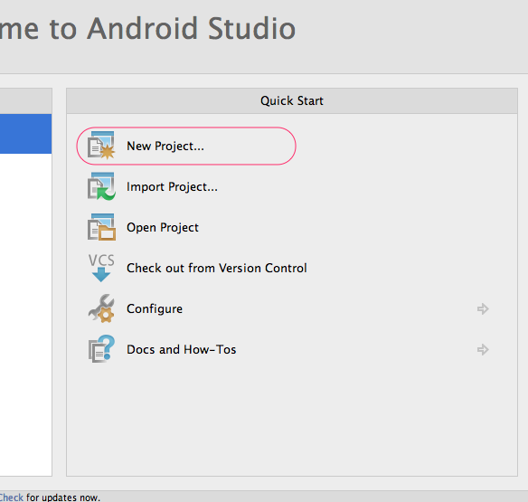
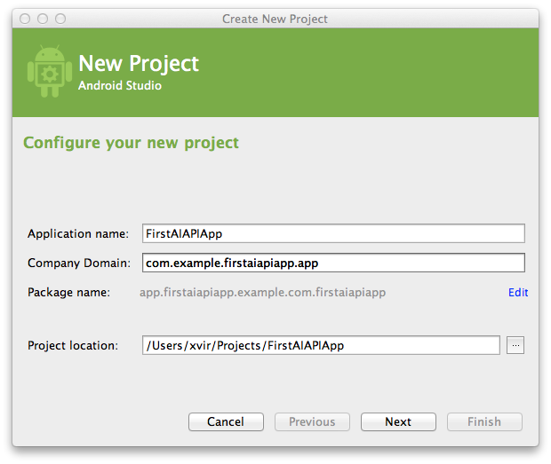
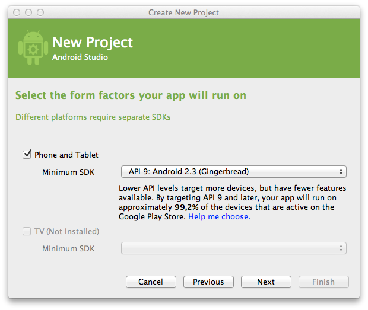
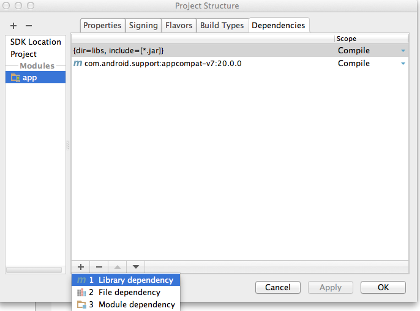
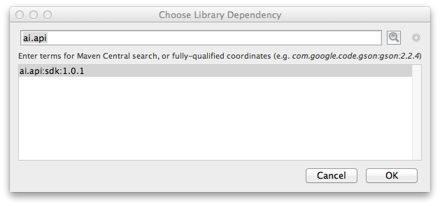
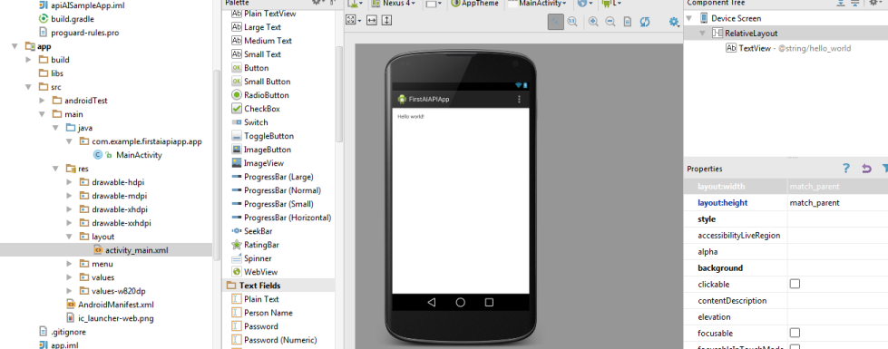
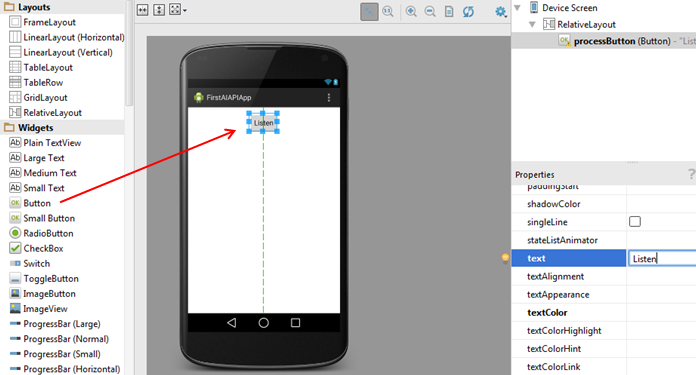
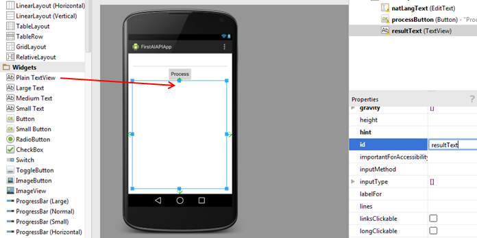
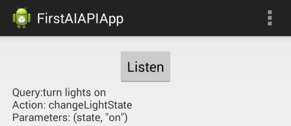

api-ai-android-sdk
==================

The API.AI Android SDK makes it easy to integrate speech recognition with [API.AI](http://www.api.ai) natural language processing API on Android devices. API.AI allows using voice commands and integration with dialog scenarios defined for a particular agent in API.AI.

Two permissions are required to use the API.AI Android SDK:

* **android.permission.INTERNET** for internet access
* **android.permission.RECORD_AUDIO** for microphone access

Currently, speech recognition is performed using Google's Android SDK, either on the client device or in the cloud. Recognized text is passed to the API.AI through HTTP requests. In the future, your client app will be able to use the SDK to send an audio file or stream to the API.AI server so that it can be processed there.

Authentication is accomplished through setting the client access token when initializing an **AIConfiguration** object. The client access token specifies which agent will be used for natural language processing.

**Note:** The API.AI Android SDK only makes query requests, and cannot be used to manage entities and intents. Instead, use the API.AI user interface or REST API to  create, retreive, update, and delete entities and intents.

# Running the Sample Code

The API.AI Android SDK comes with a simple sample that illustrates how voice commands can be integrated with API.AI. Use the following steps to run the sample code:

1. Have an API.AI agent created that has entities and intents. See the API.AI documentation on how to do this. 
2. Open [Android Studio](https://developer.android.com/sdk/installing/studio.html).
3. Import the **api-ai-android-master** directory.
4. Open the SDK Manager and be sure that you have installed Android Build Tools 19.1.
5. In the Project browser, open **apiAISampleApp/src/main/java/ai.api.sample/MainActivity**.
6. Towards the top of the file, you will see a declaration of a static final string called *ACCESS_TOKEN*. Set its value to be the client access token of your agent. Similarly, set the variable named *SUBSCRIPTION_KEY* to your subscription key.
7. Attach an Android device, or have the emulator set up with an emulated device.
8. From the **Run** menu, choose **Debug** (or click the Debug symbol). Choose your device.
9. You should see an app running with three buttons: **Listen**, **StopListen**, and **Cancel**.
10. Click **Listen** and say a phrase that will be understood by your agent. Wait a few seconds. The Java will appear that is returned by the API.AI service.

# Getting Started with Your Own App

This section describes what you need to do to get started with your own app that uses the API.AI Android SDK. The first part provides an overview of how to use the SDK, and the second part is a tutorial with detailed step-by-step instructions for creating your own app.

## Overview

To create your own app, you must first add the API.AI SDK library to your project. There are two ways to accomplish this. The first way is simpler.

* Add a dependency to your *build.gradle* file. Add the following line to your **build.gradle** file. (In the sample app, the **apiAISampleApp/build.gradle** is an example of how to do this.)
        compile 'ai.api:sdk:1.1.0'
* Download the library source code from github, and attach it to your project.

Now you can create your own app, using either integrated speech recognition or using your own speech recognition.

## Using integrated speech recognition

Once you've added the SDK library, follow these steps:

1. Add two permissions into the AndroidManifest:
    * **android.permission.INTERNET**
    * **android.permission.RECORD_AUDIO**
    
2. Create a class that implements the AIListener interface. This class will process responses from API.AI.
3. Create an instance of AIConfiguration, specifying the access token, locale, and recognition engine.
4. Use the AIConfiguration object to get a reference to the AIService, which will make the query requests.
5. Set the AIListener instance for the AIService instance.
6. Launch listening from the microphone via the **startListening** method. The SDK will start listening for the microphone input of the mobile device.
7. To stop listening and start the request to the API.AI service using the current recognition results, call the **stopListening** method of the AIService class.
8. To cancel the listening process without sending a request to the API.AI service, call the **cancel** method of the AIService class.
9. In the **onResult** method of the AIListener interface, check the response for errors using the **AIResponse.isError** method.
10. If there are no errors, you can get the result using the **AIResponse.getResult** method. From there, you can obtain the action and parameters.

## Using your own speech recognition

This section assumes that you have performed your own speech recognition and that you have text that you want to process as natural language. Once you've added the SDK library, follow these steps:

1. Add this permission into the AndroidManifest:
    * **android.permission.INTERNET**
    
2. Create an instance of **AIConfiguration**, specifying the access token, locale, and recognition engine. You can specify any recognition engine, since that value will not be used.
3. Create an **AIDataService** instance using the configuration object.
4. Create the empty **AIRequest** instance. Set the request text using the method **setQuery**.
5. Send the request to the API.AI service using the method **aiDataService.request(aiRequest)**.
6. Process the response.

The following example code sends a query with the text "Hello":

    final AIConfiguration config = new AIConfiguration(ACCESS_TOKEN, SUBSCRIPTION_KEY, 
        Locale.US.toString(), AIConfiguration.RecognitionEngine.Google);
    final AIDataService aiDataService = new AIDataService(config);
    
    final AIRequest aiRequest = new AIRequest();
    aiRequest.setQuery("Hello");
    
    try {
        final AIResponse aiResponse = aiDataService.request(aiRequest);
        // process response object here...
        
    } catch (final AIServiceException e) {
        e.printStackTrace();
    }
    
## Tutorial

This section contains a detailed tutorial about creating new app and connect it to API.AI.

### Create a new app

Follow these steps to set up your environment and create new android app with API.AI integration:

1. Create an API.AI agent with entities and intents, or use one that you've already created. See the API.AI documentation for instructions on how to do this. 
2. Open [Android Studio](https://developer.android.com/sdk/installing/studio.html). (Download it if you don't have it.)
3. From the start screen (or **File** menu) , choose **New Project...**.  
4. In the New Project dialog, fill **Application name** and **Company Domain**, then click **Next**.  
5. Choose minimum SDK for project, minimum supported by API.AI SDK is **9 Gingerbread**. Click **Next**.  
6. Select **Blank Activity** and click **Next**.
7. Enter the main activity name and click **Finish**.

### Integrate with the SDK

Next you will integrate with the SDK to be able to make calls. Follow these steps:

1. Open **AndroidManifest.xml** under **app/src/main**. 
2. Just above the `<activity>` tag, add these line in order to give the app permission to access the internet and the microphone:  

        <uses-permission android:name="android.permission.INTERNET"/>
        <uses-permission android:name="android.permission.RECORD_AUDIO" />
3. Save **AndroidManifest.xml**.
4. Next, you need to add a new dependency for the AI.API library. Right click on your module name (it should be _app_) in the Project Navigator and select **Open Module Settings**. Click on the **Dependencies** tab. Click on the **+** sign on the bottom left side and select **Library dependency**.  
5. In the opened dialog search **ai.api**, choose **ai.api:sdk:1.1.0** item then click OK.  
5. Open **MainActivity.java** under **app/src/main/java/com.example.yourAppName.app**, or whatever your package name is.
6. Expand the import section and add the following lines to import the necessary API.AI classes:

        import ai.api.AIConfiguration;
        import ai.api.AIListener;
        import ai.api.AIService;
        import ai.api.GsonFactory;
        import ai.api.model.AIError;
        import ai.api.model.AIResponse;
        import ai.api.model.Result;
        
### Create the user interface
1. Open **activity_main.xml** under **app/src/main/res/layout**. This will open the layout in the designer. 
2. Select and delete the "Hello World" TextView.
3. Drag a Button (under Widgets) to the top of the screen. Change the **id** property to "listenButton" and the **text** property to "Listen". 
4. Drag a Plain TextView (under Widgets) under the button. Expand it so that it covers the rest of the bottom of the screen. Change the **id** property to "resultTextView" and the **text** property to an empty string. 
6. Now return to the MainActivity.java file. Add three import statements to access our widgets:

        import android.view.View;
        import android.widget.Button;
        import android.widget.TextView;
7. Create two private members in MainActivity for the widgets:

        private Button processButton;
        private TextView resultTextView;
8. At the end of the OnCreate method, add these lines to initialize the widgets:

        processButton = (Button) findViewById(R.id.processButton);
        resultTextView = (TextView) findViewById(R.id.resultTextView);

### Create the AI Service and Listener
1. Use the MainActivity as the class that will be called when events occur by having it implement the AIListener class. Replace the class declaration with this:

        public class MainActivity extends ActionBarActivity implements AIListener {      
2. In the MainActivity class, create a private member for the **AIService** class named `aiService`.

         private AIService aiService;
3. In the OnCreate method, add the following line to set up the configuration to use Google speech recognition. Replace CLIENT_ACCESS_TOKEN and SUBSCRIPTION KEY with your client access token and subscription key. When it asks to add `import java.util.Locale`, say OK. 

         final AIConfiguration config = new AIConfiguration("CLIENT_ACCESS_TOKEN",
                "SUBSCRIPTION_KEY", Locale.US.toString(),
                AIConfiguration.RecognitionEngine.Google);
    
    

4. Below this line, initialize the AI service and add this instance as the listener to handle events.

        aiService = AIService.getService(this, config);
        aiService.setListener(this);       
5. Add method to start listening on the button click:

        public void listenButtonOnClick(final View view) {
            aiService.startListening();
        }
6. Return to activity_main.xml and click on the Listen button. In the properties pane, set the onClick property to listenButtonOnClick.

7. Add the following method to show the results when the listening is complete:

        public void onResult(final AIResponse response) {
            if (response.isError()) {
                resultTextView.setText("Error: " + response.getStatus().getErrorDetails());
            } else {
                Result result = response.getResult();

                // Get parameters
                String parameterString = "";
                if (result.getParameters() != null && !result.getParameters().isEmpty()) {
                    for (final Map.Entry<String, JsonElement> entry : result.getParameters().entrySet()) {
                        parameterString += "(" + entry.getKey() + ", " + entry.getValue() + ") ";
                    }
                }

                // Show results in TextView.
                resultTextView.setText("Query:" + result.getResolvedQuery() +
                    "\nAction: " + result.getAction() +
                    "\nParameters: " + parameterString);
            }
        }
8. Add the following method to handle errors:

        @Override
        public void onError(final AIError error) {
            resultTextView.setText(error.toString());
        }

9. Add the following empty methods to implement the AIListener interface:

        @Override
        public void onListeningStarted() {}
        
        @Override
        public void onListeningFinished() {}
        
        @Override
        public void onAudioLevel(final float level) {}
        
### Run the App
1. Attach an Android device to your computer or have a virtual device ready.
2. Make sure that your module is selected in the dropdown, and then click the Debug button. 
3. The app should now be running on your device or virtual device. Click the **Listen** button and then speak a phrase that will work with your intent. Wait a few seconds. The result should appear in the result TextView.  

### Troubleshooting

* If you get an error when trying to install app that says "INSTALL_FAILED_OLDER_SDK", then check you have Android SDK 19 and build tools 19.1 installed.
